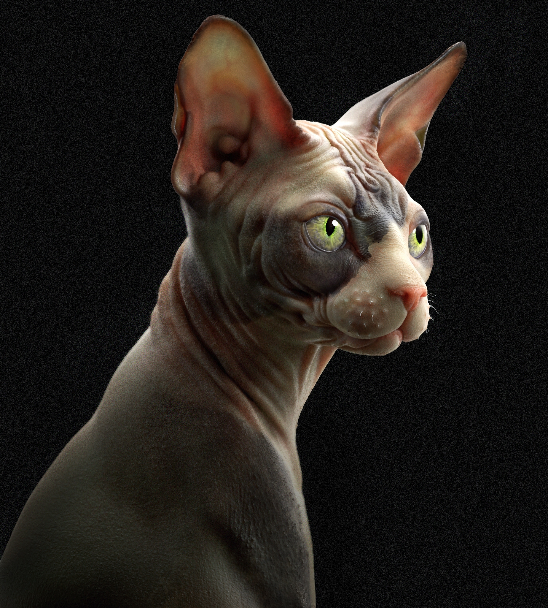

##### In a cat's eye, all things belong to cats.

## About Big Cats

There are 38 species of cats on the planet. Most, like the margay, are relatively small. But some—the lion, tiger, leopard, snow leopard, clouded leopard, jaguar, lynx, and cheetah—are big. These big cats are among the most beloved and recognizable animals on the planet.